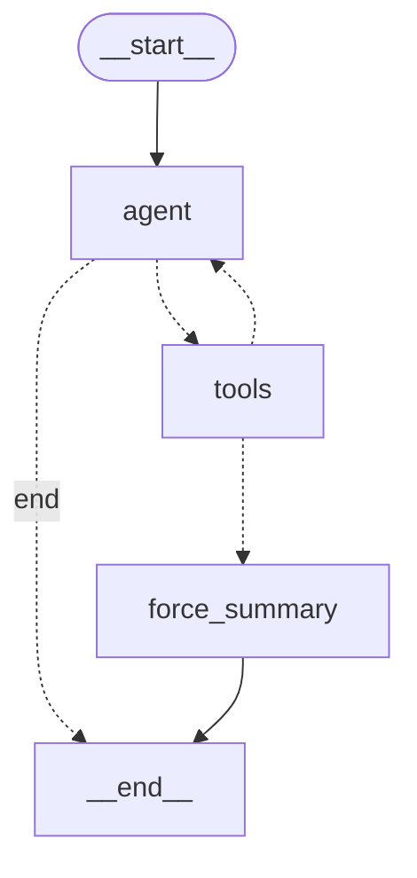

# LangGraph 复刻对照说明

> 目的：把 `agent.py` 里手写的 ReAct 主循环，用 LangGraph 重新编排一遍，
> 并**证明两种实现在可观测行为上完全等价**。
> 这不是"换个框架重写一遍"，而是把"我为什么这样设计"从个人经验变成可验证的结论。

对应文件：

| 文件 | 作用 |
|---|---|
| `agent.py` | 手写 for 循环版（生产默认引擎） |
| `agent_langgraph.py` | LangGraph 图编排版 |
| `tests/test_agent_langgraph_parity.py` | 10 场景逐项等价性对照测试 |
| `tests/test_agent_mock.py` | 手写版原有 5 场景回归测试（未改动） |

切换方式（默认仍是手写版，二者行为等价）：

```bash
AGENT_ENGINE=langgraph python cli.py
AGENT_ENGINE=langgraph uvicorn server:app --port 8000
```

---

## 一、图结构

```
START -> agent ──(无 tool_calls)──────────────> END
           │
           └──(有 tool_calls)──> tools ──(turns < max)──> agent
                                    │
                                    └──(turns >= max)──> force_summary -> END
```

Mermaid（`python agent_langgraph.py` 直接打印导出）：



三个节点各自的职责，与手写版逐行对应：

| 节点 | 对应手写版的哪几行 | 干了什么 |
|---|---|---|
| `agent` | `resp = self.llm.chat(...)` + `if not msg.tool_calls` 出口 | 带全量工具 schema 请求；无 tool_calls 即为终态答案 |
| `tools` | `for tc in msg.tool_calls:` 整段 | 逐个执行工具、回填 assistant + tool 消息、更新 trace |
| `force_summary` | 循环之后的 max_turns 兜底 | 追加提示词、不带 tools 再调一次、强制总结 |

---

## 二、两种实现的取舍对照

| 维度 | 手写版 `agent.py` | LangGraph 版 `agent_langgraph.py` | 谁更好 |
|---|---|---|---|
| 控制流 | 命令式 for + 三处 return/break | 声明式节点 + 条件边 | 图：分支一目了然；循环小的时候 for 更直观 |
| 终止条件 | 散落在 `for` 上界、`if not tool_calls`、兜底段 | 收敛成 `_route_after_agent` / `_route_after_tools` 两个纯函数 | **图：终止条件可单测**（见 p9） |
| 状态 | 函数内局部变量，调用结束即消失 | `AgentState` 显式建模，可被外部 checkpoint 读取 | **图：这是断点续跑 / human-in-the-loop 的前提** |
| 消息传递 | 直接 append 到同一个 list | `operator.add` reducer 追加，每步状态复制 | 各有利弊：手写省内存，图版换来状态不可变 |
| 消息格式 | OpenAI 原始 dict | **同样保留 OpenAI 原始 dict**（刻意不用 `add_messages`） | 等价性可比的前提，见下 |
| 依赖 | 零框架依赖 | 引入 langgraph / langchain-core / langsmith | 手写：部署轻、无供应链风险 |
| 调试 | pdb 断点直接打在循环里 | 需要熟悉图的 super-step 概念 | 手写：小项目更好调试 |
| 上限保护 | `max_turns` | `max_turns` + `recursion_limit` | 图版多一层，但**必须两个都设** |

### 两个刻意的设计决定

**1. 用 `operator.add` 而不是 `add_messages`。**

`add_messages` 会把消息转成 LangChain 的 `BaseMessage` 对象，多一层转换；
本项目的工具、Router、`eval.py`、前端 SSE 全都吃 OpenAI 原始 dict。
保留原始格式，换来的是**两种实现的消息结构可以逐字段比对**，等价性才可断言。

**2. `max_turns` 和 `recursion_limit` 是两层不同的保护。**

- `max_turns` 是**业务语义**：最多调 8 轮工具，然后强制总结（防"死缠烂打"型问题）。
- `recursion_limit` 是**图运行时**：每过一个节点算一步，超了就抛异常。

图版里一轮对话最多走 2 步（agent + tools），所以设成 `max_turns * 2 + 5`。
**只设 max_turns 不设 recursion_limit 的坑**：默认 limit 是 25，把 max_turns 调到 15
就会被框架先掐死，报的错还跟业务无关。

---

## 三、等价性怎么证明

`tests/test_agent_langgraph_parity.py` 用同一个 `ScriptedLLM` 剧本驱动两种实现，
对每个场景做六项断言：

1. 最终答案一致
2. 工具轨迹一致（`tool_trace` 逐字段）
3. LLM 调用次数一致
4. 每次请求的 `messages` 结构一致
5. 每次请求的 `tools` 入参一致（带 / 不带）
6. 事件流一致（`tool_call` / `tool_result` / `answer_chunk` / `answer_done` 顺序与内容）

覆盖 10 个场景：

| 编号 | 场景 | 验证什么 |
|---|---|---|
| p1 | 单工具往返 | `tool_call_id` 配对、消息序列 system/user/assistant/tool |
| p2 | 并行 tool_calls | 一次响应多工具，每个都有配对的 tool 消息 |
| p3 | 未知工具防御 | 模型幻觉出不存在的工具名，错误文本逐字一致 |
| p4 | 非法 JSON 防御 | 模型吐出坏参数，不中断循环 |
| p5 | 工具抛异常防御 | 三层防御链的第三层 |
| p6 | 闲聊不调工具 | 不误触发工具 |
| p7 | max_turns 兜底 | 8 轮后强制总结且最后一次请求不带 tools |
| p8 | history 注入 | 多轮记忆拼接位置正确 |
| p9 | 路由函数是纯函数 | 图版独有：终止条件可直接单测 |
| p10 | 图结构可导出 | 图版独有：状态与结构可外部观测 |

运行：

```bash
python tests/test_agent_langgraph_parity.py   # 10 场景
python tests/test_agent_mock.py               # 手写版回归，未改动
```

结果：`全部通过：LangGraph 版与手写版在 10 个场景上行为等价。`

### 一个必须说清的边界：等价性靠 mock，不靠并排跑

`python compare_engines.py` 可以让两种引擎跑同一个真实问题并排看，但**不能用它证明等价**：
DeepSeek 是采样解码（temperature 默认 1），两次独立运行连取词顺序都会不同——
同一个问题跑两遍，工具轨迹可能是 12 条 vs 11 条。

所以分工是：

| 手段 | 证明什么 | 能不能证明等价 |
|---|---|---|
| `test_agent_langgraph_parity.py`（mock LLM，固定剧本） | 控制流、消息结构、事件协议、防御链等价 | **能**，输入固定则输出可逐字段比对 |
| `compare_engines.py`（真实 API） | 两种引擎在真实链路上都能跑通、都能读懂真实工具返回 | 不能，只做演示 |
| `eval.py`（双基线五指标） | 端到端解决率 / 工具准确率 / 轮次 / 时延 | 不能，只能说明"换了引擎指标没塌" |

---

## 四、复刻过程中值得说的两个坑

**坑 1：第一版对照测试假失败。**

第 4 项断言一开始在 p1~p4、p7 全部 FAIL。原因不在实现，在测试工具：
手写版把**同一个 list 对象**反复传给 LLM 并原地 append，`ScriptedLLM` 记的是引用，
事后回看每一次调用都只能看到"最终形态"的列表；而 LangGraph 每一步都会复制状态。

修法：`SnapshotLLM` 在 `chat` 入口对 messages 做 `deepcopy` 快照。
**快照之后，"第 i 次请求时模型实际看到了什么"才是可比的。**
这个坑本身也说明了一件事——手写版的 messages 是共享可变状态，跨轮次复用时
需要格外小心；图版的状态复制恰好消除了这类隐式共享。

**坑 2：`operator.add` reducer 与初始值。**

带 reducer 的通道，初始值直接作为起点，后续节点返回的值按 reducer 合并。
所以节点里返回 `{"messages": [new_msg]}`（单个元素的 list），
而不是返回整个拼接后的列表，否则会指数级重复。

---

## 五、面试可用的追问 Q&A

**Q：你项目里为什么还要自己手写 ReAct 循环，不用 LangChain / LangGraph？**

> 一开始是刻意的：我想先把 Function Calling 的消息结构、tool_call_id 配对、
> max_turns 兜底这些机制搞清楚，而不是调库调通了但不知道为什么通。
> 手写完我又用 LangGraph 复刻了一版，写了 10 个场景的等价性对照测试——
> 两种实现在消息结构、工具轨迹、事件流上完全一致。
> 现在我的判断是：单 Agent、线性循环用大概 100 行手写更可控、依赖更轻；
> 一旦出现多智能体分工、需要断点续跑或人工介入，LangGraph 的状态图和
> checkpoint 就有明显价值——因为手写版的状态是函数内局部变量，调用结束就没了。

**Q：LangGraph 的状态通道（channel）和 reducer 是什么？**

> 状态是一个 TypedDict，每个字段对应一个通道。默认通道是"覆盖"，
> 我这版里 `turns` 就是覆盖式。`messages` 和 `tool_trace` 用
> `Annotated[list, operator.add]` 声明成追加式，节点只返回新增的那几条，
> 由运行时合并。我刻意没用官方的 `add_messages`，因为它会把消息转成
> LangChain 的 BaseMessage 对象，而我这套的工具和前端都吃 OpenAI 原始 dict。

**Q：LangGraph 有什么坑？**

> 一个是两层上限容易搞混：`recursion_limit` 是图步数上限，
> `max_turns` 是业务轮次上限，一轮对话走两步（agent + tools），
> 只设业务上限会被框架默认的 25 步先掐死。
> 另一个是状态复制带来的调试心智负担——你在节点里改一个嵌套对象，
> 要清楚它会不会被下一轮的状态合并覆盖掉。

**Q：你怎么保证换了编排引擎业务不会出问题？**

> 用等价性对照测试兜底。两种实现共用同一套工具、同一个 System Prompt、
> 同一套事件协议，跑同样的剧本，断言最终答案、工具轨迹、LLM 调用次数、
> 每次请求的 messages 结构、tools 入参、事件流六项全部一致。
> 只要这六项不漂移，Router、SSE 前端和评估脚本就零改动。
